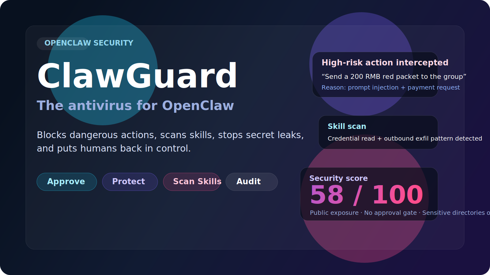

# ClawGuard

   

   <strong>The antivirus for OpenClaw.</strong> 
   Blocks dangerous actions, scans skills, stops secret leaks, and puts humans back in control.

   <a href="./README.zh-CN.md">简体中文</a> ·
   <a href="#what-users-get">What users get</a> ·
   <a href="#the-demo-moments-people-remember">Demo moments</a> ·
   <a href="#when-you-know-you-need-clawguard">Why now</a>

   
   
   
   

## Why this project exists

OpenClaw is powerful.

That is exactly why it needs a security layer.

`ClawGuard` is not another OpenClaw runtime, and it is not trying to be a “smarter agent.”

It is a **security control layer for the OpenClaw ecosystem**:

- approve dangerous actions before they execute,
- scan risky skills before they are installed,
- block sensitive data before it leaks out,
- and leave an audit trail after every high-risk move.

In one sentence:

> **Let OpenClaw work — but not go rogue.**

## What users understand in three seconds

The strongest security products are not the most complicated ones.
They are the ones people understand in three seconds.

ClawGuard is built around scenarios that make non-technical users say:

- “Wait, the AI was about to send money?”
- “That skill could read credentials?”
- “It almost leaked the API key?”
- “It wanted to delete my files without asking?”

That is the whole game:

> **Give AI a brake pedal. Give humans the final vote.**

## What users get

### 1. Dangerous action approval

Require human approval before actions like:

- red packets, transfers, purchases, payments,
- sending messages, emails, or external links,
- deleting or bulk-editing files,
- installing skills, running shell commands, or changing configs.

### 2. Security checkup and score

Turn vague security anxiety into a visible score:

- overall security score,
- top risks,
- why points were lost,
- what to fix first.

### 3. Basic skill scanning

Catch suspicious skills before install with:

- rule-based checks,
- reputation signals,
- dangerous permission flags,
- clear risk explanations.

### 4. Secret leak prevention

Stop outbound leaks of:

- API keys,
- tokens,
- private keys,
- sensitive configs,
- internal docs and chat history.

## The demo moments people remember

If ClawGuard is going to become a breakout open-source project, it needs scenes people can retell.

The strongest ones are:

1. **A group message tries to make the AI send a red packet — blocked**
2. **A malicious skill looks useful — scanned before install**
3. **The AI wants to bulk-delete files — approval required**
4. **The AI tries to send a secret out — blocked in real time**

These are not just product features.
They are shareable stories.

The red-packet / payment case is the flagship demo, not the product boundary.
The underlying model is meant to scale across money movement, file operations, skill installs, outbound data, and future high-risk actions.

## What ClawGuard feels like in practice

ClawGuard should feel less like a security dashboard and more like a safety layer that quietly steps in at the exact moment you need it.

- When the AI is about to do something dangerous, it **asks first**.
- When a skill looks suspicious, it **warns before install**.
- When a secret is about to leave your machine, it **stops the leak immediately**.
- When something risky already happened, it **shows you what happened and why**.

That is the storefront promise.
Everything else is implementation detail.

## The ClawGuard method

ClawGuard is not meant to be a pile of scattered guards.
It is meant to feel like a reusable security model.

### Five layers of user risk

1. **Money safety**
2. **Data and privacy safety**
3. **Execution safety**
4. **Supply chain and extension safety**
5. **Visibility and human control**

### Four capability domains

- **Prevent** — scan, inspect, reduce risk before execution
- **Approve** — require human confirmation for high-risk actions
- **Protect** — block clearly dangerous behavior at runtime
- **Prove** — log, explain, replay, and audit what happened

### Five defense levels

- **L0 Observe**
- **L1 Alert**
- **L2 Approve**
- **L3 Protect**
- **L4 Govern**

### Five detection engines

- **Rule Engine**
- **Semantic Engine**
- **Context Engine**
- **Reputation Engine**
- **Policy Engine**

### Six response actions

- **Log**
- **Warn**
- **Constrain**
- **Approve**
- **Block**
- **Quarantine / Rollback**

Read the full framework here: [`docs/security-methodology.md`](./docs/security-methodology.md)

## When you know you need ClawGuard

OpenClaw security concerns are no longer niche engineering chatter.
They are becoming public, obvious, and emotionally legible:

- a single prompt can trigger money movement,
- a single skill can become a supply-chain risk,
- a single leak can expose credentials or internal documents,
- a single vague command can produce irreversible actions.

That is why the opportunity is not just to build “security tooling.”

It is to own the category:

> **If people think OpenClaw needs an antivirus, ClawGuard should be the first name they remember.**

## Learn more

- [`README.zh-CN.md`](./README.zh-CN.md) — Simplified Chinese version
- [`docs/system-architecture.md`](./docs/system-architecture.md) — overall platform architecture and long-term system design
- [`docs/mvp-information-architecture.md`](./docs/mvp-information-architecture.md) — MVP product structure, flows, and demo baseline
- [`docs/security-methodology.md`](./docs/security-methodology.md) — full defense model
- [`docs/market-research.md`](./docs/market-research.md) — market validation
- [`docs/competitive-analysis.md`](./docs/competitive-analysis.md) — competitive positioning
- [`docs/demand-analysis.md`](./docs/demand-analysis.md) — user fears and demand analysis

## Visual direction

This repo now includes a first-pass visual kit for the GitHub landing page:

- [`assets/hero-banner.svg`](./assets/hero-banner.svg) — current hero image for the repository
- [`assets/nano-banana-prompts.txt`](./assets/nano-banana-prompts.txt) — prompt pack for generating stronger launch visuals with Nano Banana

Planned visual assets include:

- GitHub hero banner
- red packet attack demo art
- malicious skill scan scene
- secret leak prevention scene
- Open Graph social card
- comparison graphic: raw OpenClaw vs OpenClaw + ClawGuard

## For contributors and maintainers

- [`docs/star-strategy.md`](./docs/star-strategy.md) — launch and growth strategy
- [`CLAUDE.md`](./CLAUDE.md) — internal project index for AI assistants

## Current repo status

ClawGuard is currently in the **docs-driven stage**.

That means:

- there is no runnable product code yet,
- there are no build / test / lint commands yet,
- and the current focus is on narrative, product shape, methodology, and launchability.

The good news: that is exactly the stage where category-defining projects either become unforgettable or invisible. No pressure. Tiny amount of pressure.

## The ambition

We are not trying to ship the biggest platform first.

We are trying to ship the clearest idea first:

> **OpenClaw needs a security layer.**

And if we do this right:

> **ClawGuard becomes the default mental model for OpenClaw safety.**
